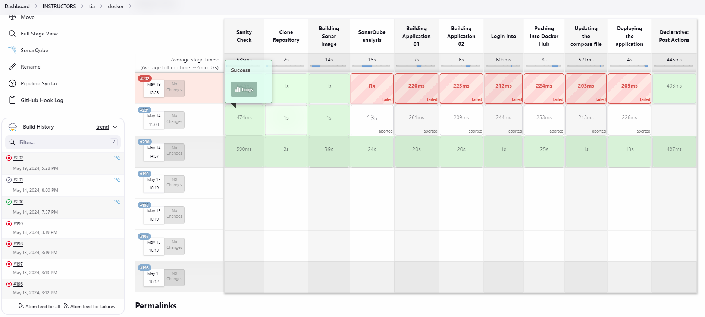

# Heading level 1
## Heading level 2
### Heading level 3
#### Heading level 4
##### Heading level 5
###### Heading level 6


- First item
- Second item
- Third item
- Fourth item
#### -----------------
* First item
* Second item
* Third item
* Fourth item
#### -----------------
+ First item
+ Second item
+ Third item
+ Fourth item
#### -----------------
- First item
- Second item
- Third item
    - Indented item
    - Indented item
- Fourth item

Italicized text is the *cat's meow*.
Italicized text is the _cat's meow_.
A*cat*meow

I just love **bold text**.
I just love __bold text__.
Love**is**bold


| Name       | Age | Occupation      |
|------------|-----|-----------------|
| John       | 30  | Software Engineer |
| Emily      | 25  | Graphic Designer |
| Michael    | 35  | Data Analyst     |
| Jessica    | 28  | Project Manager  | 


| Item                | Quantity | Price (USD) |
|---------------------|---------:|------------:|
| Laptop              |        2 |      1000   |
| Smartphone          |        3 |       500   |
| Headphones          |        5 |        50   |
| External Hard Drive |        1 |       150   |

This is the first paragraph. It contains some text to demonstrate how Markdown handles paragraphs. Each continuous block of text, separated by a blank line, is treated as a separate paragraph.

This is the second paragraph. Markdown is a lightweight markup language that allows you to write simple and easy-to-read formatted text. It's widely used for creating documentation, README files, blogs, and more.

And this is the third paragraph. Markdown provides various features such as headers, lists, code blocks, links, images, and more. It's a convenient and human-readable way to create formatted content without needing to deal with complex HTML or other markup languages.

```
This is the first paragraph. It contains some text to demonstrate how Markdown handles paragraphs. Each continuous block of text, separated by a blank line, is treated as a separate paragraph.

This is the second paragraph. Markdown is a lightweight markup language that allows you to write simple and easy-to-read formatted text. It's widely used for creating documentation, README files, blogs, and more.

And this is the third paragraph. Markdown provides various features such as headers, lists, code blocks, links, images, and more. It's a convenient and human-readable way to create formatted content without needing to deal with complex HTML or other markup languages.
```

```
#!/bin/bash

# Simple bash script to calculate the factorial of a number

read -p "Enter a number: " number

if [[ $number -lt 0 ]]; then
    echo "Error: Factorial is not defined for negative numbers."
elif [[ $number -eq 0 ]]; then
    echo "Factorial of 0 is 1."
else
    factorial=1
    for (( i=1; i<=$number; i++ )); do
        factorial=$(( factorial * i ))
    done
    echo "Factorial of $number is $factorial."
fi
```

```sh
#!/bin/bash

# Simple bash script to calculate the factorial of a number

read -p "Enter a number: " number

if [[ $number -lt 0 ]]; then
    echo "Error: Factorial is not defined for negative numbers."
elif [[ $number -eq 0 ]]; then
    echo "Factorial of 0 is 1."
else
    factorial=1
    for (( i=1; i<=$number; i++ )); do
        factorial=$(( factorial * i ))
    done
    echo "Factorial of $number is $factorial."
fi
```


```
# Sample YAML configuration

database:
  host: localhost
  port: 5432
  username: user123
  password: pass456

server:
  address: 0.0.0.0
  port: 8000
  debug: true

logging:
  level: info
  file: app.log
```

```yaml
# Sample YAML configuration

database:
  host: localhost
  port: 5432
  username: user123
  password: pass456

server:
  address: 0.0.0.0
  port: 8000
  debug: true

logging:
  level: info
  file: app.log
```

- Kubernetes manifest generator [here](https://k8syaml.com)
- Groovy validator online [here](https://onecompiler.com/groovy)
- Bash script validator online [here](https://replit.com/languages/bash)
- Yaml validator online [here](http://www.yamllint.com)
- vscode online [here](https://vscode.dev)
- Ubuntu VM online [here](https://linuxcontainers.org/lxd/try-it)
- Unix Permissions Calculator [here](http://permissions-calculator.org)
- crontab guru [here](https://crontab.guru)
- How Secure Is My Password? [here](https://www.security.org/how-secure-is-my-password/)
- kubeapps for helm chart [here](https://hub.kubeapps.com)
- Bitnami helm charts [here](https://github.com/bitnami/charts)
- Stable helm charts [here](https://github.com/helm/charts/tree/master/stabl)

[Click here to visit our website](https://www.devopseasylearning.com/)



```groovy
pipeline {
    agent any
    
    triggers {
        githubPush()
    }
    options {
        timeout(time: 30, unit: 'MINUTES') // Timeout for the entire pipeline
        buildDiscarder(logRotator(numToKeepStr: '7')) // Discard old builds to save disk space
        disableConcurrentBuilds() // Ensures that only one build can run at a time
        timestamps() // Adds timestamps to the console output
        skipDefaultCheckout() // Skips the default checkout of source code, useful if you're doing a custom checkout
        // retry(3) // Automatically retries the entire pipeline up to 3 times if it fails
    }
    environment {
        DOCKER_HUB_USERNAME="devopseasylearning"
        ALPHA_APPLICATION_01_REPO="alpha-application-01"
        ALPHA_APPLICATION_02_REPO="alpha-application-02"
        DOCKER_CREDENTIAL_ID = 's8-test-docker-hub-auth'
    }
    parameters {
        string(name: 'BRANCH_NAME', defaultValue: 'dev', description: '')
        string(name: 'APP1_TAG', defaultValue: 'latest', description: '')
        string(name: 'APP2_TAG', defaultValue: 'latest', description: '')
        string(name: 'PORT_ON_DOCKER_HOST', defaultValue: '', description: '')
    }
    stages {
        // when {
        //         expression {
        //             params.BRANCH_NAME == 'dev'
        //         }
        //     }
        // stage ('Check Allow Users') {
        //     steps {
        //         script {
        //             wrap([$class: 'BuildUser']) {
        //                 def build_id = env.BUILD_USER_ID
        //                 def build_user = env.BUILD_USER
        //                 echo "build_id : $build_id"
        //                 if (build_id in ['corneillechahoua', 'admin']) {
        //                     echo "Hi $build_user, You are allowed to run this job"
        //                 } else {
        //                     error "Hi $build_user, You are not allowed to run this job"
        //                 }
        //             }
        //         }
        //     }
        // }
        stage('Sanity Check') {
             when {
                expression {
                    params.BRANCH_NAME == 'dev2'
                }
            }
            steps {
                script {
                    sanity_check()
                }
            }
        }
        stage('Clone Repository') {
            when {
                expression {
                    params.BRANCH_NAME == 'dev2'
                }
            }
            steps {
                script {
                    git credentialsId: 'jenkins-ssh-agents-private-key',
                        url: 'git@github.com:DEL-ORG/s8-web-2.git',
                        branch: "${params.BRANCH_NAME}"
                }
            }
        }
        stage('Building Sonar Image') {
             when {
                expression {
                    params.BRANCH_NAME == 'dev2'
                }
            }
            steps {
                script {
                    dir("${WORKSPACE}/sonar-scanner") {
                        sh """
                        docker build -t ${env.DOCKER_HUB_USERNAME}/s8-sonar-scanner:latest  .
                        docker images
                        """
                    }
                }
            }
        }
        stage('SonarQube analysis') {
             when {
                expression {
                    params.BRANCH_NAME == 'dev2'
                }
            }
            steps {
                script {
                    dir("${WORKSPACE}") {
                        docker.image("devopseasylearning/s8-sonar-scanner:latest").inside('-u 0:0') {
                            withSonarQubeEnv('SonarScanner2') {
                                sh """
                                    ls -l 
                                    pwd
                                    sonar-scanner -v
                                    sonar-scanner
                                """
                            }
                        }
                    }
                }
            }
        }
        stage('Building Application 01') {
             when {
                expression {
                    params.BRANCH_NAME == 'dev2'
                }
            }
            steps {
                script {
                    sh """
                        docker build -t ${env.DOCKER_HUB_USERNAME}/app-01:${params.APP1_TAG} -f application-01.Dockerfile .
                        docker images
                    """
                }
            }
        }
        stage('Building Application 02') {
             when {
                expression {
                    params.BRANCH_NAME == 'dev2'
                }
            }
            steps {
                script {
                    sh """
                        docker build -t ${env.DOCKER_HUB_USERNAME}/app-02:${params.APP2_TAG} -f application-02.Dockerfile .
                        docker images
                    """
                }
            }
        }
        stage('Login into') {
            steps {
                script {
                    // Login to Docker Hub
                    withCredentials([usernamePassword(credentialsId: "${DOCKER_CREDENTIAL_ID}", 
                    usernameVariable: 'DOCKER_USERNAME', 
                    passwordVariable: 'DOCKER_PASSWORD')]) {
                        // Use Docker CLI to login
                        sh "docker login -u $DOCKER_USERNAME -p $DOCKER_PASSWORD"
                    }
                }
            }
        }
        stage('Pushing into Docker Hub') {
             when {
                expression {
                    params.BRANCH_NAME == 'dev'
                }
            }
            steps {
                script {
                    pushDockerhub()
                }
            }
        } 
        stage('Updating the compose file') {
            steps {
                script {
                    dir("${WORKSPACE}/docker-compose") {
                        sh """
                        sed -i "s|APP_1_IMAGE_TAG|${params.APP1_TAG}|g" docker-compose.yml
                        sed -i "s|APP_2_IMAGE_TAG|${params.APP2_TAG}|g" docker-compose.yml
                        cat docker-compose.yml
                        """
                    }
                }
            }
        }
        stage('Deploying the application') {
            steps {
                script {
                    dir("${WORKSPACE}/docker-compose") {
                        sh """
                        docker-compose up -d
                        sleep 10
                        docker ps |grep -i app
                        """
                    }
                }
            }
        }
    }
    post {
        success {
            slackSend color: '#2EB67D',
            channel: 's8-session-jenkins-alerts', 
            message: "*Alpha Project Build Status*" +
            "\n Project Name: Alpha" +
            "\n Job Name: ${env.JOB_NAME}" +
            "\n Build number: ${currentBuild.displayName}" +
            "\n Build Status : *SUCCESS*" +
            "\n Build url : ${env.BUILD_URL}"
        }
        failure {
            slackSend color: '#E01E5A',
            channel: 's8-session-jenkins-alerts',  
            message: "*Alpha Project Build Status*" +
            "\n Project Name: Alpha" +
            "\n Job Name: ${env.JOB_NAME}" +
            "\n Build number: ${currentBuild.displayName}" +
            "\n Build Status : *FAILED*" +
            "\n Action : Please check the console output to fix this job IMMEDIATELY" +
            "\n Build url : ${env.BUILD_URL}"
        }
        unstable {
            slackSend color: '#ECB22E',
            channel: 's8-session-jenkins-alerts', 
            message: "*Alpha Project Build Status*" +
            "\n Project Name: Alpha" +
            "\n Job Name: ${env.JOB_NAME}" +
            "\n Build number: ${currentBuild.displayName}" +
            "\n Build Status : *UNSTABLE*" +
            "\n Action : Please check the console output to fix this job IMMEDIATELY" +
            "\n Build url : ${env.BUILD_URL}"
        }   
    }
}

def pushDockerhub() {
    sh """
        docker push ${env.DOCKER_HUB_USERNAME}/app-01:${params.APP1_TAG}
        docker push ${env.DOCKER_HUB_USERNAME}/app-02:${params.APP2_TAG}
        docker push ${env.DOCKER_HUB_USERNAME}/s8-sonar-scanner:latest
    """
}

def sanity_check() {
    if (params.BRANCH_NAME.isEmpty()){
       echo "The parameter BRANCH_NAME is not set"
       sh 'exit 2'
   }
   if (params.APP1_TAG.isEmpty()){
       echo "The parameter APP1_TAG is not set"
       sh 'exit 2'
    }
    if (params.APP2_TAG.isEmpty()){
       echo "The parameter APP2_TAG is not set"
       sh 'exit 2'
    }
}
```